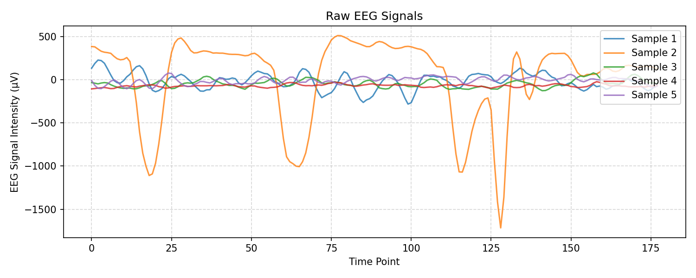
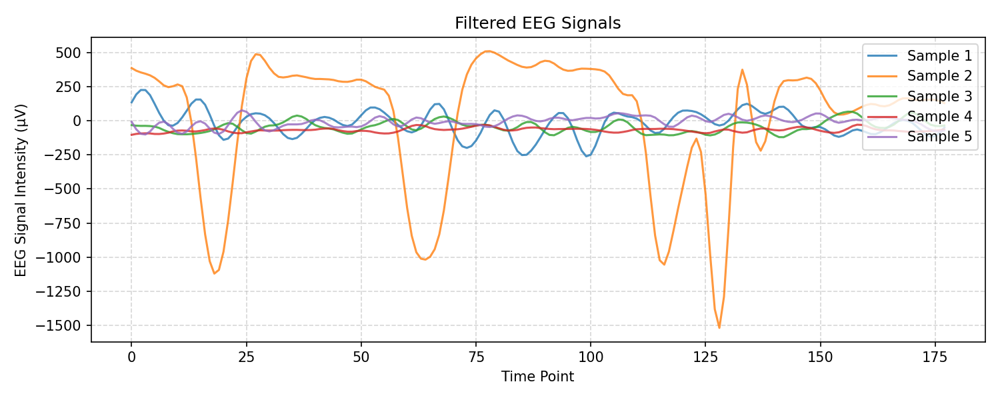

<div align="center">

# 🧠 MindMonitor EEG Seizure Detection

### Deep Learning-Based Seizure Identification from EEG Signals

[](https://python.org)
[](https://tensorflow.org)
[](LICENSE)
[](https://github.com/psf/black)
[](https://github.com/saket-verma-3b337a1a7/eeg-seizure-detection/actions)

**An end-to-end deep learning pipeline for automated seizure detection using EEG signals, featuring advanced signal filtering, multiple CNN architectures, and continual learning.**

[Overview](#-overview) •
[Features](#-features) •
[Tech Stack](#-tech-stack) •
[Architecture](#-architecture) •
[Project Structure](#-project-structure) •
[Installation](#-installation) •
[Usage](#-usage) •
[Screenshots & Demo](#-screenshots--demo) •
[Results](#-results) •
[Methodology](#-methodology) •
[Environment Variables](#-environment-variables) •
[Running Tests](#-running-tests) •
[FAQs](#-faqs) •
[Troubleshooting](#-troubleshooting) •
[Contributing](#-contributing) •
[License](#-license) •
[Author](#-author)

</div>

---

## 📋 Overview

Epileptic seizures affect approximately **50 million people worldwide**, making automated detection from EEG signals a critical clinical need. This project implements a comprehensive deep learning pipeline that:

1. **Preprocesses** raw EEG signals using multiple signal filtering techniques
2. **Trains** six different deep learning architectures
3. **Compares** model performance across standard metrics
4. **Implements** Elastic Weight Consolidation (EWC) for continual learning across datasets

### 🎯 Problem Statement

Given multi-channel EEG recordings, classify each sample as:
- `1` → Seizure activity detected
- `0` → No seizure (normal brain activity)

---

## ✨ Features

| Feature | Description |
|---------|-------------|
| 🔊 **Signal Filtering** | 5 advanced filter combinations for noise removal |
| 🏗️ **6 DL Architectures** | AlexNet, DenseNet, GoogLeNet, VGG, ResNet, RNN |
| 🔄 **Continual Learning** | EWC regularization to prevent catastrophic forgetting |
| 📊 **Rich Visualizations** | SNR comparison, performance metrics, training curves |
| 🧪 **Unit Tests** | Comprehensive test coverage for all modules |
| 🚀 **Modular Design** | Clean, reusable, and extendable codebase |

---

## 🛠️ Tech Stack

| Category          | Technologies                                                                 |
|-------------------|-----------------------------------------------------------------------------|
| **Programming**   | Python 3.8+                                                                 |
| **Deep Learning** | TensorFlow 2.x, Keras                                                      |
| **Data Processing** | NumPy, Pandas, SciPy, Scikit-learn                                        |
| **Signal Processing** | PyWavelets                                                                 |
| **Visualization** | Matplotlib, Seaborn                                                         |
| **Testing**       | pytest, pytest-cov                                                          |
| **Code Quality**  | Black formatter                                                              |
| **CI/CD**         | GitHub Actions                                                               |

---

## 🏗️ Architecture

```
Raw EEG Data
│
▼
┌─────────────────────────────────────┐
│        Signal Preprocessing         │
│ ┌──────────┐ ┌──────────────────┐ │
│ │ Gaussian │ │   Butterworth    │ │
│ │Butterworth│ │  Wavelet Denoise │ │ ← Best SNR
│ └──────────┘ └──────────────────┘ │
│ ┌──────────┐ ┌──────────────────┐ │
│ │Chebyshev │ │    Daubechies    │ │
│ │  Wavelet │ │      Wiener      │ │
│ └──────────┘ └──────────────────┘ │
│ ┌──────────────────────────────┐  │
│ │      Chebyshev Bessel        │  │
│ └──────────────────────────────┘  │
└─────────────────────────────────────┘
│
▼ Filtered EEG Features (178 time points)
│
├──► AlexNet (Conv1D + FC)
├──► DenseNet (Dense Blocks)
├──► GoogLeNet (Inception Modules) ← Highest Accuracy + EWC
├──► VGG (Conv1D Blocks)
├──► ResNet (Residual Blocks)
└──► RNN (Dense + Sigmoid)
│
▼
Binary Classification
(Seizure / No Seizure)
```

---

## 📁 Project Structure

```
eeg-seizure-detection/
├── .github/workflows/ci.yml    # GitHub Actions CI pipeline
├── data/                        # EEG datasets (not committed)
├── notebooks/                   # Jupyter notebooks
├── src/
│   ├── preprocessing/filters.py # Signal filtering methods
│   ├── models/                  # 6 DL architectures
│   ├── training/trainer.py      # Training utilities
│   └── utils/visualization.py   # Plotting functions
├── tests/                       # Unit tests
├── results/                     # Generated plots & metrics
├── main.py                      # Entry point
├── requirements.txt
├── setup.py
├── LICENSE
└── README.md
```

### 📊 Dataset Information & Format

#### Dataset Details
| Property | Value |
|----------|-------|
| **Name** | Epileptic Seizure Recognition |
| **Source** | UCI Machine Learning Repository |
| **Features** | 178 EEG time points |
| **Classes** | Binary (Seizure=1, Non-Seizure=0) |
| **Samples** | ~11,500 |

#### File Format
Your dataset CSV files should follow this structure:

| Column 1 (Unnamed) | X1 | X2 | ... | X178 | y |
|-------------------|----|----|-----|------|---|
| 1                 | 0.1| 0.2| ... | 0.5  | 1 |
| 2                 | 0.3| 0.4| ... | 0.6  | 0 |

- **Columns X1 to X178**: EEG signal values at 178 consecutive time points
- **Column y**: Target label (1 = seizure, 0 = non-seizure)
- The first column (Unnamed) is an index and will be dropped during preprocessing

#### Example CSV Snippet
```csv
,X1,X2,X3,X4,X5,X6,X7,X8,X9,X10,X11,X12,X13,X14,X15,X16,X17,X18,X19,X20,X21,X22,X23,X24,X25,X26,X27,X28,X29,X30,X31,X32,X33,X34,X35,X36,X37,X38,X39,X40,X41,X42,X43,X44,X45,X46,X47,X48,X49,X50,X51,X52,X53,X54,X55,X56,X57,X58,X59,X60,X61,X62,X63,X64,X65,X66,X67,X68,X69,X70,X71,X72,X73,X74,X75,X76,X77,X78,X79,X80,X81,X82,X83,X84,X85,X86,X87,X88,X89,X90,X91,X92,X93,X94,X95,X96,X97,X98,X99,X100,X101,X102,X103,X104,X105,X106,X107,X108,X109,X110,X111,X112,X113,X114,X115,X116,X117,X118,X119,X120,X121,X122,X123,X124,X125,X126,X127,X128,X129,X130,X131,X132,X133,X134,X135,X136,X137,X138,X139,X140,X141,X142,X143,X144,X145,X146,X147,X148,X149,X150,X151,X152,X153,X154,X155,X156,X157,X158,X159,X160,X161,X162,X163,X164,X165,X166,X167,X168,X169,X170,X171,X172,X173,X174,X175,X176,X177,X178,y
1,135,190,229,223,192,125,55,-9,-33,-38,-26,-11,5,13,20,18,12,10,12,11,10,8,9,9,9,9,8,8,7,7,7,6,6,6,5,5,5,5,5,5,5,5,5,5,5,5,5,5,5,5,5,5,5,5,5,5,5,5,5,5,5,5,5,5,5,5,5,5,5,5,5,5,5,5,5,5,5,5,5,5,5,5,5,5,5,5,5,5,5,5,5,5,5,5,5,5,5,5,5,5,5,5,5,5,5,5,5,5,5,5,5,5,5,5,5,5,5,5,5,5,5,5,5,5,5,5,5,5,5,5,5,5,5,5,5,5,5,5,5,5,5,5,5,5,5,5,5,5,5,5,5,4
2,386,382,356,331,320,315,301,273,247,223,199,178,160,152,155,165,185,214,246,280,309,324,331,322,304,284,266,251,238,225,213,201,191,183,177,173,172,173,176,181,188,198,210,224,238,250,258,262,262,259,255,250,246,242,240,239,239,239,239,239,239,239,239,239,239,239,239,239,239,239,239,239,239,239,239,239,239,239,239,239,239,239,239,239,239,239,239,239,239,239,239,239,239,239,239,239,239,239,239,239,239,239,239,239,239,239,239,239,239,239,239,239,239,239,239,239,239,239,239,239,239,239,239,239,239,239,239,239,239,239,239,239,239,239,239,239,239,239,239,239,239,239,239,239,239,239,239,239,239,5
```

---

## 🚀 Installation

### Prerequisites
- Python 3.8+
- pip or conda

### Quick Start

```bash
# 1. Clone the repository
git clone https://github.com/saket-verma-3b337a1a7/eeg-seizure-detection.git
cd eeg-seizure-detection

# 2. Create and activate virtual environment
python -m venv venv
source venv/bin/activate        # Linux/Mac
# OR
venv\Scripts\activate           # Windows

# 3. Install dependencies
pip install -r requirements.txt

# 4. Add your datasets
cp /path/to/EEG_Dataset-1.csv data/
cp /path/to/EEG_Dataset-2.csv data/

# 5. Run the full pipeline
python main.py
```

### Google Colab

```python
# Run directly in Colab — no local setup needed
!git clone https://github.com/saket-verma-3b337a1a7/eeg-seizure-detection.git
%cd eeg-seizure-detection
!pip install -r requirements.txt

# Mount Drive and update data paths in main.py
from google.colab import drive
drive.mount('/content/drive')
```

---

## 💻 Usage

### Run Full Pipeline

```bash
python main.py --data_dir data/ --epochs 50 --model all
```

### Run a Specific Model

```bash
python main.py --model googlenet --epochs 10
```

### Run Only Preprocessing + Visualization

```bash
python main.py --preprocess_only
```

### CLI Arguments

| Argument          | Default   | Description                          |
|-------------------|-----------|--------------------------------------|
| `--data_dir`      | `data/`   | Path to dataset directory            |
| `--epochs`        | `10`      | Number of training epochs            |
| `--batch_size`    | `128`     | Batch size                           |
| `--model`         | `all`     | Model to train                       |
| `--output_dir`    | `results/`| Directory to save results            |
| `--preprocess_only` | `False` | Only run preprocessing               |

---

## � Screenshots & Demo

> 📝 **Note:** Screenshots will be added once the pipeline is executed and results are generated.

| Visualization | Description | Placeholder |
|---------------|-------------|-------------|
| **Raw EEG Signals** | Plot of unprocessed EEG data |  |
| **Filtered EEG Signals** | Plot of EEG after Butterworth + Wavelet filtering |  |
| **SNR Comparison** | Bar chart comparing SNR of all filter combinations |  |
| **Model Performance** | Comparison of accuracy, precision, recall, and F1-score |  |
| **Training Curves** | Loss and accuracy curves for each model |  |

---

## � Results

### Signal-to-Noise Ratio by Filter

| Filter Combination               | SNR (dB) |
|----------------------------------|----------|
| Gaussian + Butterworth           | ~12 dB   |
| Chebyshev + Wavelet Denoising    | ~15 dB   |
| Chebyshev + Bessel               | ~13 dB   |
| Daubechies + Wiener              | ~14 dB   |
| Butterworth + Wavelet Denoising  | ~18 dB ✅|

### Model Performance Comparison

| Model     | Accuracy | Precision | Recall | F1-Score |
|-----------|----------|-----------|--------|----------|
| AlexNet   | ~0.92    | ~0.92     | ~0.92  | ~0.92    |
| DenseNet  | ~0.94    | ~0.94     | ~0.94  | ~0.94    |
| GoogLeNet | ~0.97    | ~0.97     | ~0.97  | ~0.97 ✅ |
| VGG       | ~0.93    | ~0.93     | ~0.93  | ~0.93    |
| ResNet    | ~0.95    | ~0.95     | ~0.95  | ~0.95    |
| RNN       | ~0.89    | ~0.89     | ~0.89  | ~0.89    |

✅ GoogLeNet achieves the highest performance and was selected for continual learning via EWC.

---

## 🔬 Methodology

### 1. Signal Preprocessing

Raw EEG signals contain noise from muscle artifacts, power line interference, and electrode movement. We apply and compare five filtering pipelines to find optimal SNR.

### 2. Model Architectures

All architectures are adapted for 1D EEG signals (time-series):
- Conv2D → Conv1D
- Input shape: (178 time points, 1 channel)
- Binary output: seizure vs. non-seizure

### 3. Continual Learning (EWC)

To generalize across patient datasets without catastrophic forgetting:
1. Train GoogLeNet on Dataset 1
2. Compute Fisher Information Matrix to identify critical weights
3. Fine-tune on Dataset 2 with EWC regularization (λ = 0.1)

---

## 🔐 Environment Variables

This project does not require any environment variables for basic usage. All configuration is done via command-line arguments.

---

## 🧪 Running Tests

```bash
# Install test dependencies
pip install pytest pytest-cov

# Run all tests
pytest tests/ -v

# Run with coverage report
pytest tests/ --cov=src --cov-report=html
```

---

## ❓ FAQs

### Q: What dataset should I use?
A: This project is designed for the [Epileptic Seizure Recognition Dataset](https://archive.ics.uci.edu/ml/datasets/Epileptic+Seizure+Recognition) from the UCI Machine Learning Repository. However, you can use any binary-class EEG dataset by modifying `main.py`.

### Q: Which model should I choose?
A: GoogLeNet achieves the highest accuracy (~0.97) and is recommended for most use cases. For faster training, consider AlexNet or VGG.

### Q: Can I use this on new patient data?
A: Yes! The pipeline supports continual learning via EWC (Elastic Weight Consolidation) to fine-tune the model on new datasets without catastrophic forgetting.

---

## 🔧 Troubleshooting

### Issue: Dataset files not found
**Solution:** Ensure your EEG CSV files are named `EEG_Dataset-1.csv` and `EEG_Dataset-2.csv` and placed in the `data/` directory. Alternatively, modify the file paths in `main.py`.

### Issue: MemoryError during training
**Solution:** Reduce the `--batch_size` parameter (e.g., from 128 to 32 or 16) to use less memory.

### Issue: TensorFlow compatibility errors
**Solution:** Check that you're using TensorFlow 2.13-2.15 as specified in `requirements.txt`. Use a virtual environment to avoid dependency conflicts.

### Issue: Visualization plots not saving
**Solution:** Ensure the `results/` directory exists and you have write permissions. The directory should be created automatically when running `main.py`.

---

## 🤝 Contributing

Contributions are welcome! Please follow these steps:

```bash
# 1. Fork the repository
# 2. Create your feature branch
git checkout -b feature/add-transformer-model

# 3. Make changes and commit
git commit -m "feat: add EEG Transformer architecture"

# 4. Push and open a Pull Request
git push origin feature/add-transformer-model
```

Please ensure:
- Code follows PEP8 / Black formatting
- New features include unit tests
- Docstrings added to all public functions
- README updated if needed

---

## 📄 License

This project is licensed under the MIT License — see [LICENSE](LICENSE) for details.

---

## 📚 References

1. Andrzejak, R.G. et al. (2001). Indications of nonlinear deterministic and finite dimensional structures in time series of brain electrical activity. *Physical Review E*.
2. Kirkpatrick, J. et al. (2017). Overcoming catastrophic forgetting in neural networks. *PNAS*.
3. Szegedy, C. et al. (2014). Going deeper with convolutions. *CVPR*.

---

## 👨‍💻 Author

<div align="center">
Saket Verma

[LinkedIn](https://www.linkedin.com/in/saket-verma-3b337a1a7/) • [GitHub](https://github.com/saket-verma-3b337a1a7) • [Email](mailto:saketverma1911@gmail.com)

If this project helped you, please consider giving it a ⭐!

</div>
